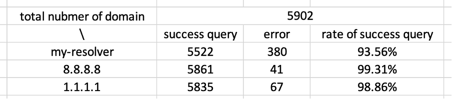
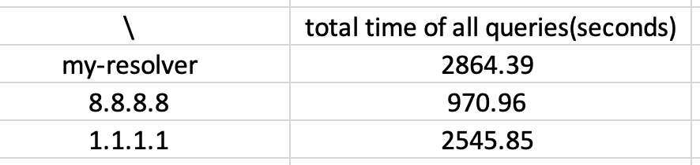

# simple-DNS-resolver

## background
Using python, implement a simple DNS resolver that can resolve domain names to their corresponding IP addresses.

There are a DNS Query Handler and DNS Response Handler, respectively take charge of send DNS queries to servers and extract the IP address.

## how to use
1. use command line `python resolver.py [port]` to start listen the port

2. use command line `python client.py [resolver_ip] [port] [website_name] [timeout] [type(alternative)]` to get IP addresses

*type*: MX, CNAME, NS

## compare to `1.1.1.1` and `8.8.8.8`
Imported the time library in python to calculate the query start time and end time.

Use write() method to automatically store the returned solution time after each domain name is sent. If the query fails, then an error message is stored instead of solution time.

1. The rate of success query, it’s a little sat my resolver is the last but it makes sense.

2. This is the total time of all queries (5092).

## Lessons Learned
1. How DNS works – Understanding the basic principles of DNS, including how domain names are resolved.
2. Socket programming in Python – Using Python’s socket module to build a client and server for network communication.
3. Parsing server responses – Extracting and interpreting DNS response data.
4. Client-server communication – Sending queries from a client to a resolver and receiving responses.

## Limitations
1. Better response parsing – The current implementation is somewhat redundant. It could be improved by using the BytesIO library for more efficient parsing.
2. Using classes for better structure – Instead of handling everything procedurally, defining classes for headers and flags would make the code more organized and reusable.
3. Error handling with try-except – Adding proper exception handling would make the program more robust and prevent unexpected crashes.

Overall, this was an early project where I was still learning. I hope to improve my approach and write cleaner, more maintainable code in the future. 🚀